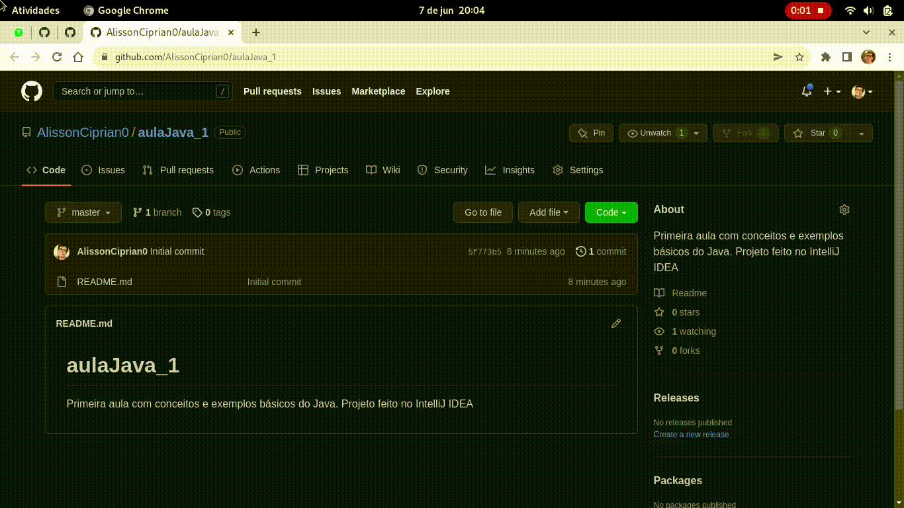
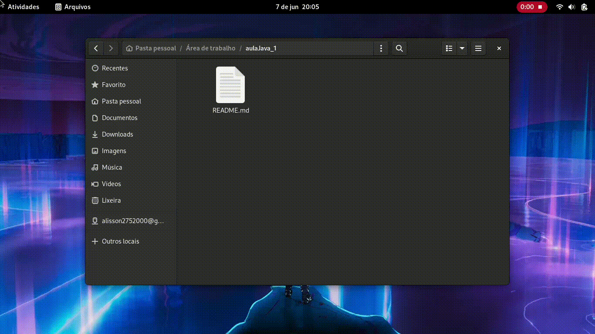
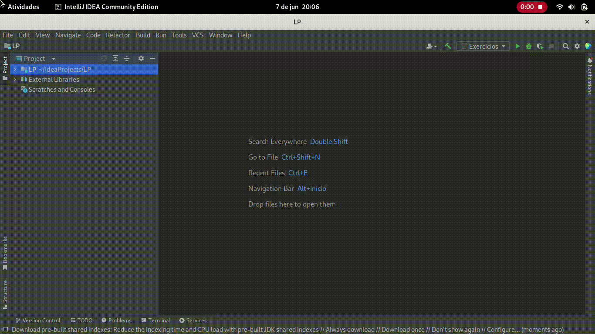
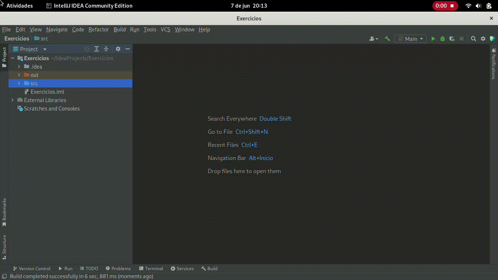

# aulaJava_1
Primeira aula com conceitos e exemplos básicos do Java. Projeto feito no IntelliJ IDEA

## Como usar esse exemplo
- [Faça o clone do projeto](#clone)
- Instale o [Java SDK](https://www.oracle.com/java/technologies/downloads/) em sua máquina
- Instale o [IntelliJ IDEA](https://www.jetbrains.com/pt-br/idea/download/#section=windows) em sua máquina
- [Abra o IntelliJ IDEA](#abrir-ide)
- [Abra o projeto baixado](#abrir-projeto) (via clone) no IntelliJ IDEA
- [Abra a classe Main e clique no ícone verde para rodar o projeto](#rodar-projeto)
- [Aula gravada em vídeo](https://we.tl/t-mlQD1R0zML) (construção do projeto)

<a name="clone"/>

<a name="abrir-ide"/>

<a name="abrir-projeto"/>

<a name="rodar-projeto"/>

